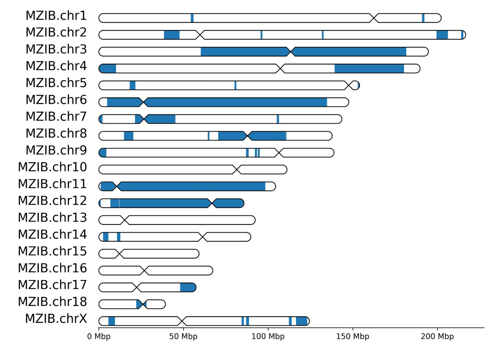
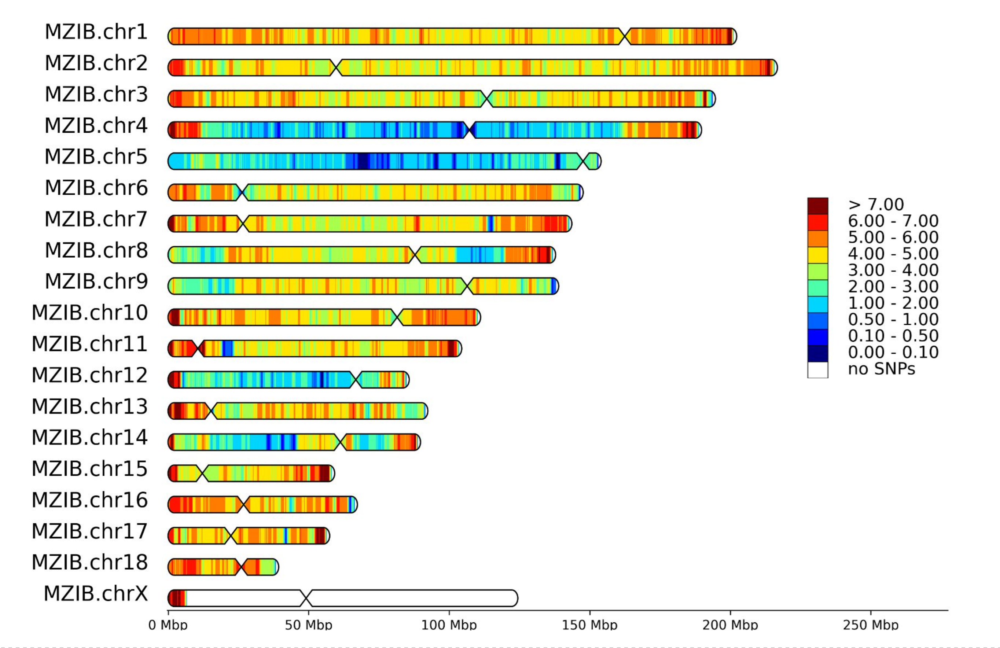
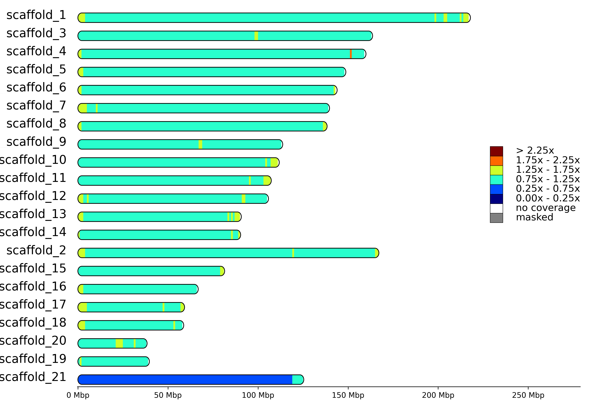
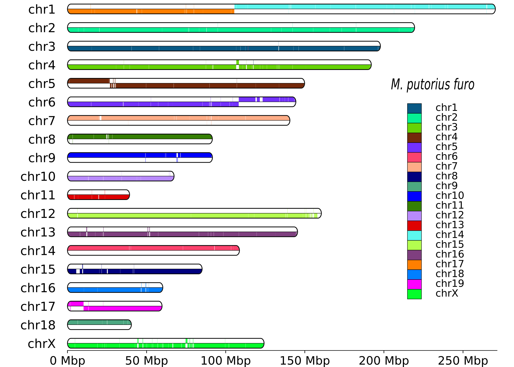

<p align="center">
  <h1 align="center">MACE</h1>
</p>

<p align="center">
  <i>Tool for visualization of chromosome tracks, synteny and genomic features</i>
</p>

# Disclaimer

**MACE** is still in a pre-alpha stage and under heavy development.
The documentation has many gaps and scripts likely have many bugs or are not user-friendly yet. 
I highly encourage everyone to report any observed bugs, problems and suggestions by opening an issue in the MACE repository. 
Suggestion on new scripts and plots are very welcome too.
For specific requests or collaboration (projects on Mustelidae genomics are very welcome), please email to _sergei.kliver@sund.ku.dk_ or _mahajrod@gmail.com_


# Installation
_As of 06 April 2026, the latest version of MACE was **1.1.38**._

There are two recommended ways to install MACE.

**Option 1**: use conda to get *'relatively stable'* version of the MACE

This option makes MACE scrips available globally.

```shell
mamba install -c mahajrod routoolpa mace
```

**Option 2**: install semi manually from github to get the latest version of MACE.

```shell
# Step1: install MACE and RouToolPa dependencies
mamba install 'python>=3.9' 'pandas' 'scipy' 'numpy>=1.26' 'matplotlib' 'biopython' \
              'bcbio-gff' 'ete3' 'statsmodels' 'pyparsing' 'xmltodict' 'venn' 'xlsxwriter'

# Step2: clone RouToolPa and MACE repositories from github
git clone https://github.com/mahajrod/RouToolPa
git clone https://github.com/mahajrod/MACE

# Step3: add RouToolPa and MACE folders to PYTHONPATH environment variable to your ~/.bashrc file         
```
**Option 2** makes MACE scripts available locally from MACE/scripts folder.

# Important MACE scripts
The documentation is under development, please, read help of scripts carefully. Most options have a good descriptions.
In case of uncertainty or problems, open an issue in the MACE repository.

1. **draw_features.py** - visualizes  precomputed tracks in various formats on chromosomes
<p align="center">
    <br>
<em>Figure 1: Runs of homozigosity for Martes zibelina (sable) individual 10xmzib. From Tomarovsky et al, 2026.  </em>
</p>

2. **draw_variant_window_densities.py** - calculates and visualizes on chromosomes densities of variants from VCF file
<p align="center">
    <br>
<em>Figure 2: Density of heterozygous SNPs for kidas (Martes zibelina x Martes martes) individual T87. From Tomarovsky et al, 2026. </em>
</p>

3. **draw_coverage.py** - visualizes  precomputed coverage on chromosomes
<p align="center">
    <br>
<em>Figure 3:   </em>
</p>

4. **draw_synteny.py** - visualizes  pairwise synteny on chromosomes of target genome

<p align="center">
    <br>
<em>Figure 4: Synteny plot between Mustela putorius (domestic ferret genome, target, 2n=40) and Mustela nigripes (black-footed ferret, reference, 2n=38). From Kliver et al, 2023.  </em>
</p>

5. **draw_macrosynteny.py** - visualizes whole genome alignments
<p align="center">
    <br>
<em>Figure 5:   </em>
</p>

# Documentation
_Wiki for scripts is under development_

# API
MACE is mostly developed according to _library + wrapping scripts_ scheme. 
_API documentation is under development._
Some library related code is still present in scripts, but eventually it will migrate.


# How to cite MACE

MACE is still in a pre-alpha stage and far from being published.
However, three already published articles on genomics of Mustelidae have significantly affected development of the MACE scripts.
Please, cite the **MACE repository** (https://github.com/mahajrod/MACE) and one or several of **articles from the list below**, depending on what scripts have you used.

1. **draw_features.py** or **draw_variant_window_densities.py**:  
Tomarovsky AA, Totikov AA, Bulyonkova TM, Perelman PL, Abramov AV, Serdyukova NA, ..., and Kliver S. 2026. Genomics of Sable (_Martes zibellina_) × Pine Marten (_Martes martes_) Hybridization. _Genome Biol Evol_ 18:evag018. https://doi.org/10.1093/gbe/evag018
2. **draw_macrosynteny.py**:  
Totikov AA, Tomarovsky AA, Perelman PL, Bulyonkova TM, Serdyukova NA, Yakupova AR, ..., and Kliver S. 2026. Comparative Genomics and Phylogenomics of the Mustelinae Lineage (Mustelidae, Carnivora). _Genome Biol Evol_ 18:evag014. https://doi.org/10.1093/gbe/evag014
3. **draw_synteny.py**:  
Kliver S, Houck ML, Perelman PL, Totikov A, Tomarovsky A, Dudchenko O, ..., and Koepfli K-P 2023. Chromosome-length genome assembly and karyotype of the endangered black-footed ferret (_Mustela nigripes_). _Journal of Heredity_:esad035. https://doi.org/10.1093/jhered/esad035
4. **draw_coverage.py**
Any of above articles

Happy visualization! 

Sergei Kliver
