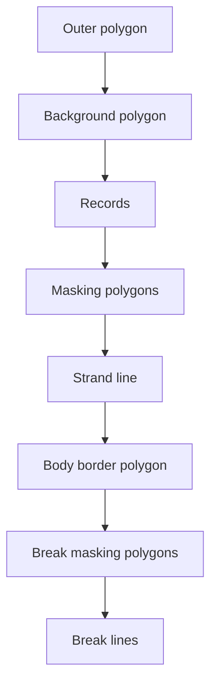

```mermaid
    flowchart TD
        Draw0["Outer polygon"] --> Draw1["Background polygon"]
        Draw1 --> Draw2["Records"]
        Draw2 --> Draw3["Masking polygons"]
        Draw3 --> Draw4["Strand line"]
        Draw4 --> Draw5["Body border polygon"]
        Draw5 --> Draw6["Break masking polygons"]
        Draw6 --> Draw7["Break lines"]
```